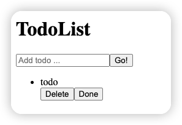
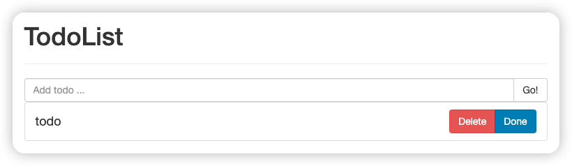

# 一小时学会React基础
> 作者：markzzw(zhangzewei) 日期：2024年1月15日
代码样例：[Codesandbox](https://codesandbox.io/p/sandbox/anything-sgxjhd?file=%2Fsrc%2FTodos.js%3A52%2C15)

读者将会通过本篇文章对`React`的基础有一定的认识，能够使用其基本的特性和功能进行小规模项目或者组件的开发。

本文所教学的React版本为`React 18`，将使用 react 进行一个简单的todolist的编写。

## 工具

对于程序员来说，写代码的工具是必不可少的，这里我推荐的是微软出品的[vscode](https://code.visualstudio.com/)，这个是前端主流的开发工具，当然也可以使用其他的工具例如：vim，sublime，atom，webstorm等。

以上工具都是需要在电脑中安装了才可以使用的，对于快速学习而言，或者对于没有在编程环境的情况下，我们可以使用一些线上的工具进行学习，本文将会使用 [CodeSandbox](https://codesandbox.io/) 进行教学。

首先需要注册一个 `CodeSandbox` 的账号，推荐使用 github 账号进行关联注册，然后点击右上角 `创建按钮(create)`，选择 `Create a Sandbox` 在弹出层的搜索框内输入关键词 `react`，随后选择 `React`，网站就能帮你自动创建一个 react 的项目。

## React 的函数组件

在创建好的项目中，打开 `App.jsx / App.js` 后可以看到，里面的主体是一个函数，这个就是 react 的函数式组件，我们可以尝试修改其中标签内部的文字，然后保存文件，就能在右边的视窗中查看到更新的内容。

```jsx
export default function App() {
  return (
    <div className="App">
      <h1>Hello CodeSandbox</h1>
      <h2>Start editing to see some magic happen!</h2>
    </div>
  );
}
```

## JSX语法

在文件中，React 的函数组件返回了一个html的结构，这个结构是react的 jsx 语法，react 能够将其转变成为包含嵌套关系的 react 自己的创建节点的函数，在初学的过程中我们只需要理解到html结构就是这个 react 组件的 html 结构，能够展示在页面上的结构即可。

那么接下来，我们将使用 jsx 语法在 App 函数中书写完成一个 todolist 的基础 html 结构，但是注意在jsx的语法中，样式标签`class` 变成了 `className`。

```jsx
// 样式引入
import './styles.css';

export default function App() {
  return (
    <div className="container">
      <div className="row">
        <div className="page-header">
          <h1>TodoList</h1>
        </div>

        <div className="input-group">
            <input
            type="text"
            className="form-control"
            placeholder="Add todo ..."
            />
            <span className="input-group-btn">
            <button className="btn btn-default" type="button">
                Go!
            </button>
            </span>
        </div>
        <ul className="list-group">
            <li className="list-group-item list-item">
                <span>todo</span>
                <div className="btn-group" role="group">
                    <button
                    type="button"
                    className="btn btn-danger"
                    >
                        Delete
                    </button>
                    <button
                    type="button"
                    className="btn btn-primary"
                    >
                        Done
                    </button>
                </div>
            </li>
        </ul>
      </div>
    </div>
  );
}
```

保存刷新页面之后得到下面界面。


这个界面比较粗糙，我们使用bootstrap为其添加一些样式，先打开[Bootstrap3](https://v3.bootcss.com/getting-started/)

拷贝以下代码粘贴进入 `public/index.html` 的 `head` 部分
```html
<link rel="stylesheet" href="https://cdn.bootcdn.net/ajax/libs/twitter-bootstrap/3.4.1/css/bootstrap.min.css" integrity="sha384-HSMxcRTRxnN+Bdg0JdbxYKrThecOKuH5zCYotlSAcp1+c8xmyTe9GYg1l9a69psu" crossorigin="anonymous">
```

然后在 `src/styles.css` 文件中添加

```css
.list-item {
  display: flex;
  justify-content: space-between;
  align-items: center;
  font-size: large;
}
```

就能够得到一个较为整洁的界面



## useState 的使用

在react的框架体系中，我们需要知道一件事，就是数据驱动界面，也就是通过改变数据进而改变我们的界面，react 中最小的数据管理方案就是使用`useState` 管理当前组件的 state。

在 `App.js` 中添加

```jsx
// 引入 useState
import { useState } from 'react'
// 样式引入
import './styles.css';

export default function App() {
    const [todolist, setTodolist] = useState([]);
    return (
        <div className="container">
            <div className="row">
                <div className="page-header">
                <h1>TodoList</h1>
                </div>

                <div className="input-group">
                    <input
                    type="text"
                    className="form-control"
                    placeholder="Add todo ..."
                    />
                    <span className="input-group-btn">
                    <button className="btn btn-default" type="button">
                        Go!
                    </button>
                    </span>
                </div>
                <ul className="list-group">
                    { // 使用 {} 能够在jsx中书写js表达式
                        todolist.map((item, index) => (
                            // key 是返回数组html的必须参数，它能够帮助react进行数组html的更新，key必须是唯一的
                            <li className="list-group-item list-item" key={index}>
                                <span>todo</span>
                                <div className="btn-group" role="group">
                                    <button
                                    type="button"
                                    className="btn btn-danger"
                                    >
                                        Delete
                                    </button>
                                    <button
                                    type="button"
                                    className="btn btn-primary"
                                    >
                                        Done
                                    </button>
                                </div>
                            </li>
                        ))
                    }
                </ul>
            </div>
        </div>
    );
}
```

随后我们可以将 
```jsx
const [todolist, setTodolist] = useState([]);
```
改为
```jsx
const [todolist, setTodolist] = useState([{
    text: 'todo',
    status: 'active'
}]);
``` 
我们会发现页面上原本没有todolist的，但是现在出现了第一条，首先`useState()`函数可以传入初始值，然后返回一个数组，数组的第一个是当前的 state，第二个是更新 state 的函数，利用 `useState()`，我们可以实现一个简单的todolist。

## 函数绑定

现在我们可以进一步，新增添加一个todo的功能，我们期望在输入框中输入，然后点击 `Go!` 按钮进行添加，这里就需要对 html 元素进行函数的绑定，我们知道在一般对元素绑定函数的方法为在html上写出`on-[操作名称]`的方式[（参考链接）](https://www.w3schools.com/tags/ref_eventattributes.asp)，例如：`<input onchange="myFunction()">`，那么在jsx中我们依旧采用这种方法，不一样的点是jsx中采用驼峰命名方法，然后使用华括弧包裹住函数，例如：`<input onChange={myFunction}>`

```jsx
import "./styles.css";
import { useState } from "react";

export default function App() {
  const [todolist, setTodolist] = useState([
    {
      text: "todo",
      status: "active",
    },
  ]);
  // 控制输入框的值
  const [inputValue, setInputValue] = useState("");
  // 监听输入框的值修改
  const handleInput = (e) => {
    const value = e.target.value.trim();
    if (value) {
      setInputValue(value);
    }
  };
  // 添加一条todo
  const handleAdd = () => {
    if (inputValue) {
      // 每次setstate都需要是一个全新的值
      setTodolist(
        todolist.concat({
          text: inputValue,
          status: "active",
        })
      );
      setInputValue("");
    }
  };
  return (
    <div className="container">
      <div className="row">
        <div className="page-header">
          <h1>TodoList</h1>
        </div>

        <div className="input-group">
          <input
            type="text"
            className="form-control"
            placeholder="Add todo ..."
            value={inputValue}
            // 函数绑定
            onChange={handleInput}
          />
          <span className="input-group-btn">
            <button
              // 函数绑定
              onClick={handleAdd}
              className="btn btn-default"
              type="button"
            >
              Go!
            </button>
          </span>
        </div>
        <ul className="list-group">
          {
            // 使用 {} 能够在jsx中书写js表达式
            todolist.map((item, index) => (
              // key 是返回数组html的必须参数，它能够帮助react进行数组html的更新，key必须是唯一的
              <li className="list-group-item list-item" key={index}>
                
                <span>{
                    // 将获取到的todo对象的文字展示出来 
                    item.text
                }</span>
                <div className="btn-group" role="group">
                  <button type="button" className="btn btn-danger">
                    Delete
                  </button>
                  <button type="button" className="btn btn-primary">
                    Done
                  </button>
                </div>
              </li>
            ))
          }
        </ul>
      </div>
    </div>
  );
}
```
在使用 input 和其值的时候，react 建议我们使用 state 进行 input 的 value 的控制，这样子符合 react 的数据变更引起界面变更的原则。

那么接下来一样的使用 `useState()` 完成 `完成todo/删除todo` 的功能。

```jsx
import "./styles.css";
import { useState } from "react";

export default function App() {
  const [todolist, setTodolist] = useState([
    {
      text: "todo",
      status: "active",
    },
  ]);
  const [inputValue, setInputValue] = useState("");
  const handleInput = (e) => {
    const value = e.target.value.trim();
    if (value) {
      setInputValue(value);
    }
  };

  const handleAdd = () => {
    if (inputValue) {
      setTodolist(
        todolist.concat({
          text: inputValue,
          status: "active",
        })
      );
      setInputValue("");
    }
  };

  const handleDelete = (index) => {
    // 在todolist数组中筛选出不是当前项的items然后重新setState达到delete的效果
    const newList = todolist.filter((_, idx) => index !== idx);
    setTodolist(newList);
  };

  const handleDone = (item, idx) => {
    // 根据 status 对当前item进行数据更新然后返回新的todolist数组进行setState
    if (item.status === "active") {
      const newList = todolist.map((item, index) => ({
        ...item,
        status: idx === index ? "done" : item.status,
      }));
      setTodolist(newList);
    } else {
      const newList = todolist.map((item, index) => ({
        ...item,
        status: idx === index ? "active" : item.status,
      }));
      setTodolist(newList);
    }
  };
  return (
    <div className="container">
      <div className="row">
        <div className="page-header">
          <h1>TodoList</h1>
        </div>

        <div className="input-group">
          <input
            type="text"
            className="form-control"
            placeholder="Add todo ..."
            // 绑定state上的value
            value={inputValue}
            // 绑定函数
            onChange={handleInput}
          />
          <span className="input-group-btn">
            <button
              // 绑定函数
              onClick={handleAdd}
              className="btn btn-default"
              type="button"
            >
              Go!
            </button>
          </span>
        </div>
        <ul className="list-group">
          {
            // 使用 {} 能够在jsx中书写js表达式，通过map返回html数组
            todolist.map((item, index) => (
              // key 是返回数组html的必须参数，它能够帮助react进行数组html的更新，key必须是唯一的
              <li className="list-group-item list-item" key={index}>
                <span
                  className={
                    // 使用status对其样式进行不一样的渲染
                    item.status
                  }
                >
                  {item.text}
                </span>
                <div className="btn-group" role="group">
                  <button
                    onClick={() => handleDelete(index)}
                    type="button"
                    className="btn btn-danger"
                  >
                    Delete
                  </button>
                  <button
                    onClick={() => handleDone(item, index)}
                    type="button"
                    className="btn btn-primary"
                  >
                    {
                      // 通过status进行文案的重新渲染
                      item.status === "active" ? "Done" : "Undone"
                    }
                  </button>
                </div>
              </li>
            ))
          }
        </ul>
      </div>
    </div>
  );
}
```

## 组件抽离

随着开发的继续，代码会逐渐增多，如果将代码都放在一个文件中会变得难以维护，所以我们会对组件进行抽离，简单组件抽离就是将单个的功能的代码放在一个文件里面，然后导出给其他文件使用，那么我们将进行如下简单抽离，抽离出来的组件依然是一个函数的形式。

**AddTodo.js**

```jsx
import { useState } from "react";
export default function AddTodo() {
  const [inputValue, setInputValue] = useState("");
  const handleInput = (e) => {
    const value = e.target.value.trim();
    if (value) {
      setInputValue(value);
    }
  };

  const handleAdd = () => {
    if (inputValue) {
      setTodolist(
        todolist.concat({
          text: inputValue,
          status: "active",
        })
      );
      setInputValue("");
    }
  };
  return (
    <div className="input-group">
      <input
        type="text"
        className="form-control"
        placeholder="Add todo ..."
        // 绑定state上的value
        value={inputValue}
        // 绑定函数
        onChange={handleInput}
      />
      <span className="input-group-btn">
        <button
          // 绑定函数
          onClick={handleAdd}
          className="btn btn-default"
          type="button"
        >
          Go!
        </button>
      </span>
    </div>
  );
}
```

**Todos.js**

```jsx
import { useState } from "react";
export default function Todos() {
  const [todolist, setTodolist] = useState([
    {
      text: "todo",
      status: "active",
    },
  ]);
  const handleDelete = (index) => {
    // 在todolist数组中筛选出不是当前项的items然后重新setState达到delete的效果
    const newList = todolist.filter((_, idx) => index !== idx);
    setTodolist(newList);
  };

  const handleDone = (item, idx) => {
    // 根据 status 对当前item进行数据更新然后返回新的todolist数组进行setState
    if (item.status === "active") {
      const newList = todolist.map((item, index) => ({
        ...item,
        status: idx === index ? "done" : item.status,
      }));
      setTodolist(newList);
    } else {
      const newList = todolist.map((item, index) => ({
        ...item,
        status: idx === index ? "active" : item.status,
      }));
      setTodolist(newList);
    }
  };
  return (
    <ul className="list-group">
      {
        // 使用 {} 能够在jsx中书写js表达式，通过map返回html数组
        todolist.map((item, index) => (
          // key 是返回数组html的必须参数，它能够帮助react进行数组html的更新，key必须是唯一的
          <li className="list-group-item list-item" key={index}>
            <span
              className={
                // 使用status对其样式进行不一样的渲染
                item.status
              }
            >
              {item.text}
            </span>
            <div className="btn-group" role="group">
              <button
                onClick={() => handleDelete(index)}
                type="button"
                className="btn btn-danger"
              >
                Delete
              </button>
              <button
                onClick={() => handleDone(item, index)}
                type="button"
                className="btn btn-primary"
              >
                {
                  // 通过status进行文案的重新渲染
                  item.status === "active" ? "Done" : "Undone"
                }
              </button>
            </div>
          </li>
        ))
      }
    </ul>
  );
}
```

**App.js**

```jsx
import "./styles.css";
import { useState } from "react";
import AddTodo from "./AddTodo";
import Todos from "./Todos";

export default function App() {
  return (
    <div className="container">
      <div className="row">
        <div className="page-header">
          <h1>TodoList</h1>
        </div>
        <AddTodo />
        <Todos />
      </div>
    </div>
  );
}
```

## Props 的使用

但是我们发现现在点击 `Go!` 按钮会报错，这是因为数据被分开了，不能够对todolist进行增加操作了，要解决这个问题就需要让 `<AddTodo />` 和`<Todos />` 共享数据，这时候就需要使用到 `props` 把数据传入各个组件内部进行渲染。

Props 就是该组件的参数，绑定props对象的方法就是直接在组件外部的jsx上写上其props的名称，例如：
```jsx
function Todos(props) {
    // 获取props
    const {
        todos,
        onDone,
        onDelete
    } = props;
}

// 设置props
<Todos
    todos={todolist}
    onDelete={handleDelete}
    onDone={handleDone}
/>
```

首先还是将 todolist 放在 App.js 这一层组件中，`<AddTodo />` 和`<Todos />` 可以提供函数操作的 props 对todolist进行操作，进而达到更新的目的，然后重新渲染。


**AddTodo.js**

```jsx
import { useState } from "react";
export default function AddTodo(props) {
  // 获取props
  const { onAdd } = props;
  const [inputValue, setInputValue] = useState("");
  const handleInput = (e) => {
    const value = e.target.value.trim();
    if (value) {
      setInputValue(value);
    }
  };

  const handleAdd = () => {
    if (inputValue) {
      onAdd(inputValue);
      setInputValue("");
    }
  };
  return (
    <div className="input-group">
      <input
        type="text"
        className="form-control"
        placeholder="Add todo ..."
        // 绑定state上的value
        value={inputValue}
        // 绑定函数
        onChange={handleInput}
      />
      <span className="input-group-btn">
        <button
          // 绑定函数
          onClick={handleAdd}
          className="btn btn-default"
          type="button"
        >
          Go!
        </button>
      </span>
    </div>
  );
}
```

**Todos.js**

```jsx
export default function Todos(props) {
  // 获取props
  const { todos, onDone, onDelete } = props;
  const handleDelete = (index) => {
    // 在todos数组中筛选出不是当前项的items然后重新setState达到delete的效果
    const newList = todos.filter((_, idx) => index !== idx);
    onDelete && onDelete(newList);
  };

  const handleDone = (item, idx) => {
    // 根据 status 对当前item进行数据更新然后返回新的todos数组进行setState
    if (item.status === "active") {
      const newList = todos.map((item, index) => ({
        ...item,
        status: idx === index ? "done" : item.status,
      }));
      onDone && onDone(newList);
    } else {
      const newList = todos.map((item, index) => ({
        ...item,
        status: idx === index ? "active" : item.status,
      }));
      onDone && onDone(newList);
    }
  };
  return (
    <ul className="list-group">
      {
        // 使用 {} 能够在jsx中书写js表达式，通过map返回html数组
        todos.map((item, index) => (
          // key 是返回数组html的必须参数，它能够帮助react进行数组html的更新，key必须是唯一的
          <li className="list-group-item list-item" key={index}>
            <span
              className={
                // 使用status对其样式进行不一样的渲染
                item.status
              }
            >
              {item.text}
            </span>
            <div className="btn-group" role="group">
              <button
                onClick={() => handleDelete(index)}
                type="button"
                className="btn btn-danger"
              >
                Delete
              </button>
              <button
                onClick={() => handleDone(item, index)}
                type="button"
                className="btn btn-primary"
              >
                {
                  // 通过status进行文案的重新渲染
                  item.status === "active" ? "Done" : "Undone"
                }
              </button>
            </div>
          </li>
        ))
      }
    </ul>
  );
}
```

**App.js**

```jsx
import "./styles.css";
import { useState } from "react";
import AddTodo from "./AddTodo";
import Todos from "./Todos";

export default function App() {
  const [todolist, setTodolist] = useState([
    {
      text: "todo",
      status: "active",
    },
  ]);
  const handleAdd = (value) =>
    setTodolist(
      todolist.concat({
        text: value,
        status: "active",
      })
    );
  const handleDelete = (newList) => {
    setTodolist(newList);
  };
  const handleDone = (newList) => {
    setTodolist(newList);
  };
  return (
    <div className="container">
      <div className="row">
        <div className="page-header">
          <h1>TodoList</h1>
        </div>
        <AddTodo onAdd={handleAdd} />
        <Todos todos={todolist} onDelete={handleDelete} onDone={handleDone} />
      </div>
    </div>
  );
}
```
## useEffect 的简单使用

目前来说我们这个todolist是一个一次性的页面，当我们刷新之后，之前的todolist全部会被清空，在一般的开发过程中，我们会将todolist保存在某个数据库中，然后在界面加载的时候去将其取回，这里需要用 `useEffect(() => {}, [])` 去做存取的操作。

UseEffect 的第二个参数是一个依赖数组，如果数组为空，则在组件渲染初期运行一次第一个参数函数，如果数组内部有值，则当里面的某一个值发生变化就执行一次第一个参数函数。

在这里我们将todolist存在localstorage，然后在第一次加载的时候去获取历史记录，在todolist发生改变的时候存储当前todolist。

在这里在 setState() 中写一个回调函数，这个回调函数的参数为未更新的state，然后可以在函数内部对state做一些操作之后将其返回，返回的这个值就会更新成为新的state。

**App.js**

```jsx
import "./styles.css";
import { useEffect, useState } from "react";
import AddTodo from "./AddTodo";
import Todos from "./Todos";

export default function App() {
  const [todolist, setTodolist] = useState([]);
  const getTodoFromLocalstorage = () => {
    const todos = localStorage.getItem("todos");
    if (todos) return JSON.parse(todos);
    return [];
  };
  useEffect(() => {
    // 从数据存储源获取数据，一般这里会从后端获取数据
    setTodolist(getTodoFromLocalstorage);
  }, []);
  const handleAdd = (value) =>
    setTodolist((prevList) => {
      const newList = prevList.concat({
        text: value,
        status: "active",
      });
      localStorage.setItem("todos", JSON.stringify(newList));
      return newList;
    });
  const handleTodoChange = (newList) => {
    setTodolist(() => {
      localStorage.setItem("todos", JSON.stringify(newList));
      return newList;
    });
  };
  return (
    <div className="container">
      <div className="row">
        <div className="page-header">
          <h1>TodoList</h1>
        </div>
        <AddTodo onAdd={handleAdd} />
        {todolist && <Todos todos={todolist} onChange={handleTodoChange} />}
      </div>
    </div>
  );
}
```

## 结束
至此，以上就是react的基础知识和操作，记住两个原则
1. 数据更改决定ui界面更改
2. 函数式编程，传入参数变化函数返回结果随之变化 引申出，数据变化，导致ui界面重新渲染。