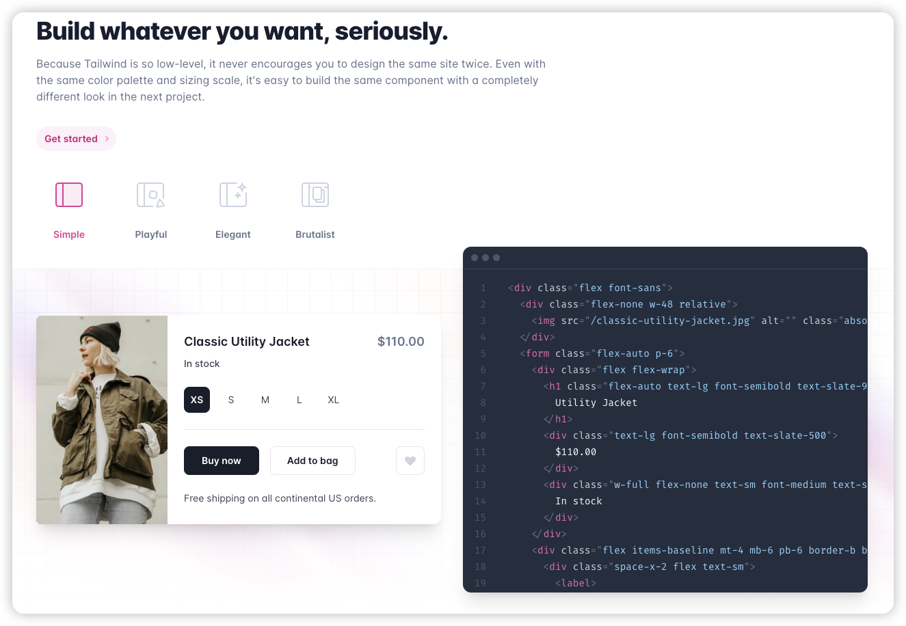
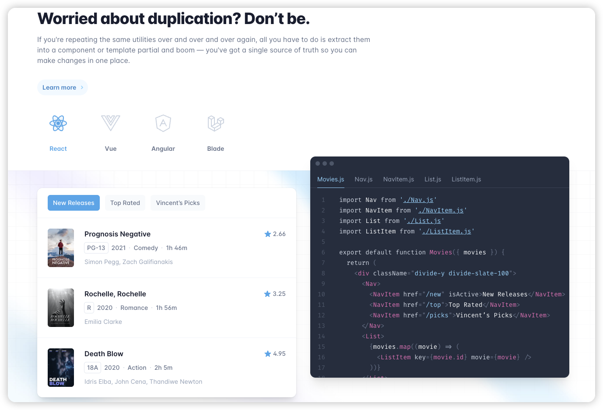

# Use tailwind by atomic design methodology 
> author: markzzw  &nbsp;&nbsp;&nbsp;  date: 2023-12-06

Tailwind CSS has gradually become the preferred style processing solution in front-end development. Its simple integration and flexible configurability make it gradually occupy a higher position in front-end development. However, with the use of Tailwind CSS, many front-end developers have also experienced discomfort. Too many classnames cause the code to look untidy, and in the case of complex styles, writing Tailwind CSS is very complicated, which is not conducive to maintenance, so can the above problems be solved by following the theory of atomic components when using Tailwind CSS?

## Atomic Component


Before discussing how to combine atomic components and Tailwind CSS, let's take a look at the atomic component methodology, which divides pages into the following five levels.
1. Atoms
    
    For the definition of the atom as the smallest non-divisible component in the design system, then we should split the web page should be the corresponding html native tag with the corresponding style, that is, input/h1/button and other components, such components can not be split again, and can be used independently.
2. Molecules

    A molecule is defined as a component of the design system composed of atomic components, such as a search box with a search button, avatar, card, etc
3. Organisms

    An organization is defined as a component composed of atoms and molecules in the design system. Such components generally have certain business capabilities, such as tab components, datepicker components, and list components
4. Templates

    The template is defined as a high-reuse interface without data composed of atoms, molecules, and organizations in the design system, such as the table page of the background management system, which has high reuse.
5. Pages

    The definition of the page is that after the template is filled with data, the real page is displayed, also known as a high-fidelity page.


Each level is pieced together from the previous levels to form the final page. In this methodology, the main thing is to find atomic components. The following figure helps us to label the atomic components well (native Html elements).

## Atomic Component fit with Tailwind CSS

The page is made up of basic components. The atomic component methodology is not to split the page components as small as possible, but to form molecular components through atomic components and organize components, and then build pages through page templates, which is a process from small to large.

In the development methodology of atomic components, we need to clearly identify which Atomic components are, and then modify the atomic components. Tailwind CSS is just the methodology of Atomic CSS, turning the miscellaneous css styles into a single css attribute. 

This solves the problem of hard-to-read html code with a lot of classnames in the code, which is to wrap atomic components and then use atomic components to compose molecular components.

This code is an example of the official website, we will use this example to refactor to show how to do the atomic component.



```jsx
function ShoppingCard() {
    return <div className="flex font-sans">
        <div className="flex-none w-48 relative">
            
        </div>
        <form className="flex-auto p-6">
            <div className="flex flex-wrap">
                <h1 className="flex-auto text-lg font-semibold text-slate-900">
                    Utility Jacket
                </h1>
                <div className="text-lg font-semibold text-slate-500">
                    $110.00
                </div>
                <div className="w-full flex-none text-sm font-medium text-slate-700 mt-2">
                    In stock
                </div>
            </div>
            <div className="flex items-baseline mt-4 mb-6 pb-6 border-b border-slate-200">
                <div className="space-x-2 flex text-sm">
                    <label>
                        <input className="sr-only peer" name="size" type="radio" value="xs" checked />
                        <div className="w-9 h-9 rounded-lg flex items-center justify-center text-slate-700 peer-checked:font-semibold peer-checked:bg-slate-900 peer-checked:text-white">
                            XS
                        </div>
                    </label>
                    <label>
                        <input className="sr-only peer" name="size" type="radio" value="s" />
                        <div className="w-9 h-9 rounded-lg flex items-center justify-center text-slate-700 peer-checked:font-semibold peer-checked:bg-slate-900 peer-checked:text-white">
                            S
                        </div>
                    </label>
                    <label>
                        <input className="sr-only peer" name="size" type="radio" value="m" />
                        <div className="w-9 h-9 rounded-lg flex items-center justify-center text-slate-700 peer-checked:font-semibold peer-checked:bg-slate-900 peer-checked:text-white">
                            M
                        </div>
                    </label>
                    <label>
                        <input className="sr-only peer" name="size" type="radio" value="l" />
                        <div className="w-9 h-9 rounded-lg flex items-center justify-center text-slate-700 peer-checked:font-semibold peer-checked:bg-slate-900 peer-checked:text-white">
                            L
                        </div>
                    </label>
                    <label>
                        <input className="sr-only peer" name="size" type="radio" value="xl" />
                        <div className="w-9 h-9 rounded-lg flex items-center justify-center text-slate-700 peer-checked:font-semibold peer-checked:bg-slate-900 peer-checked:text-white">
                            XL
                        </div>
                    </label>
                </div>
            </div>
            <div className="flex space-x-4 mb-6 text-sm font-medium">
                <div className="flex-auto flex space-x-4">
                    <button className="h-10 px-6 font-semibold rounded-md bg-black text-white" type="submit">
                        Buy now
                    </button>
                    <button className="h-10 px-6 font-semibold rounded-md border border-slate-200 text-slate-900" type="button">
                        Add to bag
                    </button>
                </div>
                <button className="flex-none flex items-center justify-center w-9 h-9 rounded-md text-slate-300 border border-slate-200" type="button" aria-label="Like">
                    <svg width="20" height="20" fill="currentColor" aria-hidden="true">
                        <path fill-rule="evenodd" clip-rule="evenodd" d="M3.172 5.172a4 4 0 015.656 0L10 6.343l1.172-1.171a4 4 0 115.656 5.656L10 17.657l-6.828-6.829a4 4 0 010-5.656z" />
                    </svg>
                </button>
            </div>
            <p className="text-sm text-slate-700">
                Free shipping on all continental US orders.
            </p>
        </form>
    </div>
}
```
This code looks messy and difficult to maintain, and we will look for the atomic components that need to be encapsulated.

### Button componenet
`Button component` is the most common component that we can extract.

So we can do a simple encapsulating.
```tsx
import { ButtonHTMLAttributes } from "react"

type ButtonVariant =
    | 'filled'
    | 'outlined'
interface ButtonProps extends ButtonHTMLAttributes<HTMLButtonElement> {
    variant: ButtonVariant;
}

export default function Button(props: ButtonProps) {
    const {
        type,
        variant,
        className,
        children
    } = props;
    const variantClassNames: {[key: string]: string} = {
        filled: 'bg-black text-white',
        outlined: 'border border-slate-200 text-slate-900'
    }
    return <button
        className={`h-10 px-6 font-semibold rounded-md ${variantClassNames[variant]} ${className}`}
        type={type}>
        {children}
    </button>
}
```

then we can use it as.

```jsx
function ShoppingCard() {
    return ...
        <div className="flex-auto flex space-x-4">
            <Button variant="filled">Buy now</Button>
            <Button variant="outlined"> Add to bag</Button>
        </div>
    ...
}
```

### Icon component
Also `svg` can been encapsulated as an atomic component.

```tsx
interface IconProps {
    size?: number
}

export default function HeartIcon (props: IconProps) {
    const { size = 20 } = props;
    const rate = size / 20;
    return <svg style={{ transform: `scale(${rate})` }} width='20' height='20' fill="currentColor" aria-hidden="true">
        <path
            fillRule="evenodd"
            clipRule="evenodd"
            d="M3.172 5.172a4 4 0 015.656 0L10 6.343l1.172-1.171a4 4 0 115.656 5.656L10 17.657l-6.828-6.829a4 4 0 010-5.656z"
        />
    </svg>
}
```

### Radio component

We can find out the `Radio component`, so we need to encapsulate the `<input type="radio" />`

```tsx
import { InputHTMLAttributes } from "react";

interface RadioProps extends InputHTMLAttributes<HTMLInputElement> {
    label: string;
}

export default function Radio(props: RadioProps) {
    const { label, name, value, checked, className, onChange } = props;
    return <label className="relative cursor-pointer" htmlFor={label}>
        <input
            className="sr-only peer"
            type="radio"
            id={label}
            value={value}
            name={name}
            checked={checked}
            onChange={onChange}
        />
        <div
            className={`min-w-[36px] min-h-[36px] p-2 rounded-lg flex items-center justify-center text-slate-700 peer-checked:font-semibold peer-checked:bg-slate-900 peer-checked:text-white ${className}`}
        >
            {label}
        </div>
    </label>
}
```

then we well use it like this.

```jsx
function ShopingCard() {
  const sizeList = [
    'XS', 'S', 'M', 'L', 'XL'
  ];
  const onSizeChange = (event: ChangeEvent<HTMLInputElement>) => {
    setCurrentSize(event.target.value);
  }
  const [currentSize, setCurrentSize] = useState(sizeList[0])
  return (
    ...
            <div className="space-x-2 flex text-sm">
              {
                sizeList.map(size => <Radio
                  key={size}
                  name="size"
                  value={size}
                  label={size}
                  checked={currentSize === size}
                  onChange={onSizeChange}
                />)
              }
            </div>
     ...
  )
}
```

According to the atomic table, we have completed the encapsulation of part of the `Form atomic components` above. Next, we will identify the types of other atomic components.

### Typography component
Document sections

```tsx
import { PropsWithChildren } from "react";

interface TypographyProps extends PropsWithChildren {
    className?: string;
    variant: 'h1' | 'h2' | 'h3' | 'h4' | 'h5' | 'h6' | 'lead' | 'paragraph'
}

interface TextProps extends PropsWithChildren {
    className?: string;
}

export default function Typography(props: TypographyProps) {
    const { variant, children, className } = props;
    const baseClassNames = 'block antialiased tracking-normal font-sans font-semibold';
    const typographies = {
        h1: (p: TextProps) => <h1 className={`${baseClassNames} text-5xl leading-tight ${p.className}`}>{p.children}</h1>,
        h2: (p: TextProps) => <h2 className={`${baseClassNames} text-4xl leading-[1.3]  ${p.className}`}>{p.children}</h2>,
        h3: (p: TextProps) => <h3 className={`${baseClassNames} text-3xl leading-snug ${p.className}`}>{p.children}</h3>,
        h4: (p: TextProps) => <h4 className={`${baseClassNames} text-2xl leading-snug ${p.className}`}>{p.children}</h4>,
        h5: (p: TextProps) => <h5 className={`${baseClassNames} text-xl leading-snug ${p.className}`}>{p.children}</h5>,
        h6: (p: TextProps) => <h6 className={`${baseClassNames} text-lg leading-relaxed ${p.className}`}>{p.children}</h6>,
        lead: (p: TextProps) => <p className={`${baseClassNames} text-base font-normal leading-relaxed ${p.className}`}>{p.children}</p>,
        paragraph: (p: TextProps) => <p className={`${baseClassNames} text-sm font-normal leading-relaxed ${p.className}`}>{p.children}</p>,
    }
    return typographies[variant]({
        className,
        children
    });
}
```

in this component we can see the classname is a little heavy, Tailwind CSS provides `@apply` decorator, so we can name classname as it's meaning.

```css
.base-font {
    @apply block antialiased tracking-normal font-sans font-semibold;
}

.heading1 {
    @apply text-5xl leading-tight;
}

.heading2 {
    @apply text-4xl leading-[1.3];
}

.heading3 {
    @apply text-3xl leading-snug;
}

.heading4 {
    @apply text-2xl leading-snug;
}

.heading5 {
    @apply text-xl leading-snug;
}

.heading6 {
    @apply text-lg leading-relaxed;
}

.lead {
    @apply text-base font-normal leading-relaxed;
}

.paragraph {
    @apply text-sm font-normal leading-relaxed;
}
```
---

```tsx
import { PropsWithChildren, createElement } from "react";
import './style.css'; // import style

interface TypographyProps extends PropsWithChildren {
    className?: string;
    variant: 'h1' | 'h2' | 'h3' | 'h4' | 'h5' | 'h6' | 'lead' | 'paragraph';
}

export default function Typography(props: TypographyProps) {
    const { variant, children, className } = props;
    const headingElements = ['h1' , 'h2' , 'h3' , 'h4' , 'h5' , 'h6'];
    const typographiesClassName = {
        h1: 'heading1',
        h2: 'heading2',
        h3: 'heading3',
        h4: 'heading4',
        h5: 'heading5',
        h6: 'heading6',
        lead: 'lead',
        paragraph: 'paragraph'
    };
    return createElement(
        headingElements.includes(variant) ? variant : 'p',
        { className: `base-font ${typographiesClassName[variant]} ${className}` },
        children
    );
}
```
### Card

Group content
```tsx
import { HTMLAttributes } from "react";

interface CardProps extends HTMLAttributes<HTMLDivElement> { }

export default function Card(props: CardProps) {
    const { children, className } = props;
    return <div className={`flex font-sans shadow-md p-2 rounded-xl overflow-hidden ${className}`}>
        {children}
    </div>
}
```
### Final ShoppingCard
In the end, our shopping card code became easier to maintain and read than before, and there were actually some small components that could be separated, such as dividers and pictures.
```tsx
function ShoppingCard() {
  const sizeList = [
    'XS', 'S', 'M', 'L', 'XL'
  ];
  const onSizeChange = (event: ChangeEvent<HTMLInputElement>) => {
    setCurrentSize(event.target.value);
  }
  const [currentSize, setCurrentSize] = useState(sizeList[0]);
  
  return (
    <div className="flex items-center justify-center h-screen">
      <Card>
        <div className="flex-none w-48 relative">
          
        </div>
        <form className="flex-auto p-6">
          <div className="flex flex-wrap">
            <Typography variant="h6" className="flex-auto text-slate-900" >Utility Jacket</Typography>
            <Typography variant="h6" className="text-slate-500" >$110.00</Typography>
            <Typography variant="lead" className="text-slate-700 mt-2 w-full" >In stock</Typography>
          </div>
          <div className="flex items-baseline mt-4 mb-6 pb-6 border-b border-slate-200">
            <div className="space-x-2 flex text-sm">
              {
                sizeList.map(size => <Radio
                  key={size}
                  name="size"
                  value={size}
                  label={size}
                  checked={currentSize === size}
                  onChange={onSizeChange}
                />)
              }
            </div>
          </div>
          <div className="flex space-x-4 mb-6 text-sm font-medium">
            <div className="flex-auto flex space-x-4">
              <Button variant="filled">Buy now</Button>
              <Button variant="outlined"> Add to bag</Button>
            </div>
            <Button variant="outlined" className="px-2.5">
              <HeartIcon size={24} />
            </Button>
          </div>

          <Typography variant="paragraph" className="text-slate-700" >
            Free shipping on all continental US orders.
          </Typography>
        </form>
      </Card>
    </div>
  )
}
```

There are also corresponding instructions in the official website, how to do the splitting of components.



With the separation of Atomic components, the patchwork page will become intuitive and clear, which is the combination of Atomic Component and Atomic CSS, one is the atomic of logic level and the other is the atomic of style level, in this way can truly achieve the Atomic methodology.

<hr />

### Reference

> 1. [Atomic Design Methodology](https://atomicdesign.bradfrost.com/chapter-2/)
> 2. [material-tailwind-react](https://github.com/creativetimofficial/material-tailwind/tree/main/packages/material-tailwind-react)
> 3. [Tailwind css](https://tailwindcss.com/)
> 4. [Github of this article](https://github.com/zhangzewei/tailwind-practice)